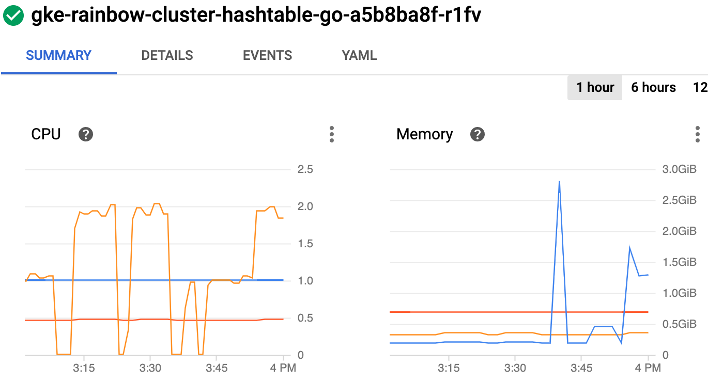
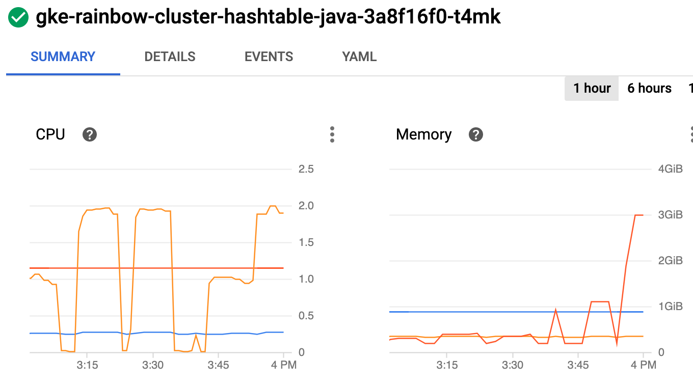
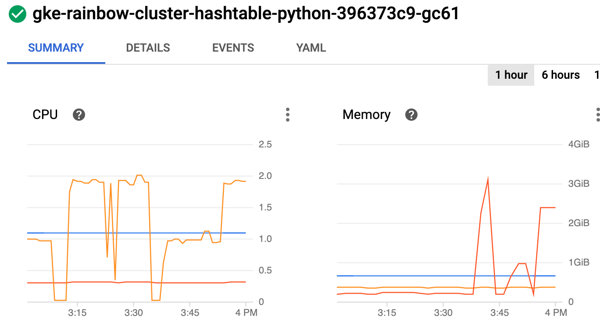
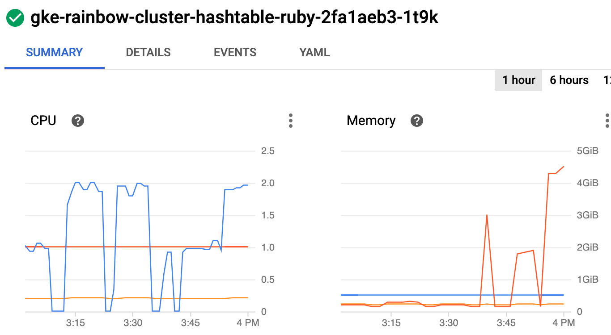
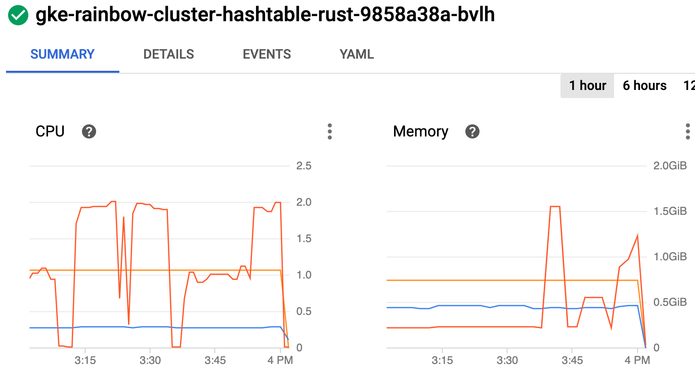

# hashtable

Generate a [Hash table](https://en.wikipedia.org/wiki/Hash_table) and access it randomly.

## Implementations

* [go](/base/go/hashtable.go)
* [java](/base/java/src/main/java/compute/hashtable.java)
* [python](/base/python/hashtable.py)
* [ruby](/base/ruby/hashtable.rb)
* [rust](/base/rust/src/hashtable.rs)

## Example of implementation

```java
    void compute(){
        int size = Integer.parseInt(System.getenv("HASHTABLE_SIZE"));
        int readCount = Integer.parseInt(System.getenv("READ_COUNT"));

        // create an input map and an array
        Map<UUID, UUID> hashtable = new Hashtable<UUID, UUID>(size, 1.0);
        UUID[] keys = new UUID[size];

        // init the map
        for (int i=0; i<size; i++) {
            UUID key = UUID.randomUUID();
            hashtable.put(key, key);
            keys[i] = key;
        }

        // access map
        for (int i=0; i<readCount;i++) {
            int index = ThreadLocalRandom.current().nextInt(0, size);
            UUID key = keys[index];
            hashtable.get(key);
        }
        
    }
```

## Results

For more information about the testing methodology see [Run the rainbow tests in the cloud](/k8s/README.md).

### Test Output

First run: large size, 10/1 read/write
```
BATCH_SIZE=5
HASHTABLE_SIZE=50000
READ_COUNT=500000
DURATION=10min
MACHINE_TYPE=e2-standard-2 (2xCPU 8GB)
```

| Lang | Replicas | Count |
| --- | --- | --- |
| go | 1 | 4690 |
| go | 3 | 6315 |
| java | 1 | 8550 |
| java | 3 | 8785 |
| python | 1 | 380 |
| python | 3 | 440 |
| ruby | 1 | 735 |
| ruby | 3 | 985 |
| rust | 1 | 12245 |
| rust | 3 | 14705 |

Second run: medium size, 100/1 read/write
```
BATCH_SIZE=50
HASHTABLE_SIZE=10000
READ_COUNT=1000000
DURATION=10min
MACHINE_TYPE=e2-standard-2 (2xCPU 8GB)
```

| Lang | Replicas | Count |
| --- | --- | --- |
| go | 3 | 8600 |
| java | 3 | 17950 |
| python | 3 | 300 |
| ruby | 3 | 1250 |
| rust | 3 | 12150 |

python:latest-hashtable.computed 300
go-hashtable.computed 8600
rust-hashtable.computed 12150
java-hashtable.computed 17950
ruby:latest-hashtable.computed 1250

Third run: very large size, 20/1 read/write
```
BATCH_SIZE=1
HASHTABLE_SIZE=5000000
READ_COUNT=100000000
DURATION=10min
MACHINE_TYPE=e2-standard-2 (2xCPU 8GB)
```

| Lang | Replicas | Count |
| --- | --- | --- |
| go | 1 | 17 |
| go | 3 | 27 |
| java | 1 | 15 |
| java | 3 | 15 |
| python | 1 | 1 |
| python | 3 | 0 |
| ruby | 1 | 2 |
| ruby | 3 | 3 |
| rust | 1 | 17 |
| rust | 3 | 25 |

### Node Metrics

* 1st spike: 1 replica, write/read 50,000/500,000
* 2nd spike: 3 replicas, write/read 50,000/500,000
* 3rd spike: 3 replicas, write/read 10,000/1,000,000
* 4th spike: 1 replicas, write/read 5,000,000/100,000,000
* 5th spike: 3 replicas, write/read 5,000,000/100,000,000

<br/>
<br/>
<br/>
<br/>
<br/>

## Rainbow Scores

| Lang | Score |
| --- | --- |
| rust | 87 |
| java | 72 |
| go | 64 |
| ruby | 8 |
| python | 3 |

Maximum value gets 100, and other scores are relative percentage to maximum value.
