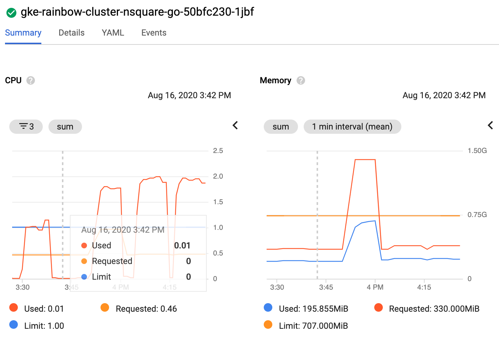
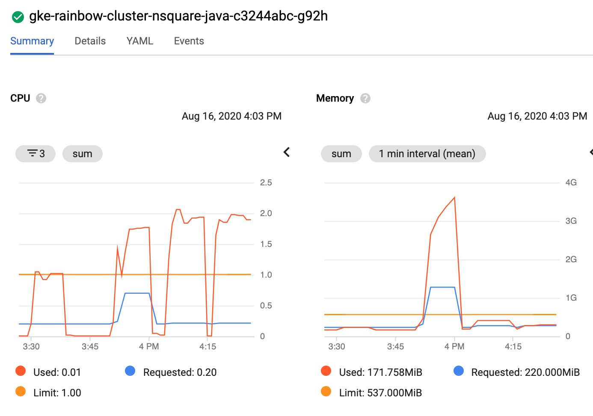
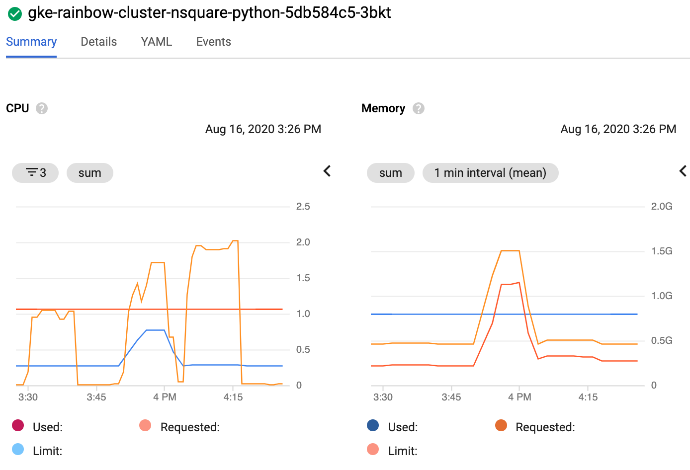
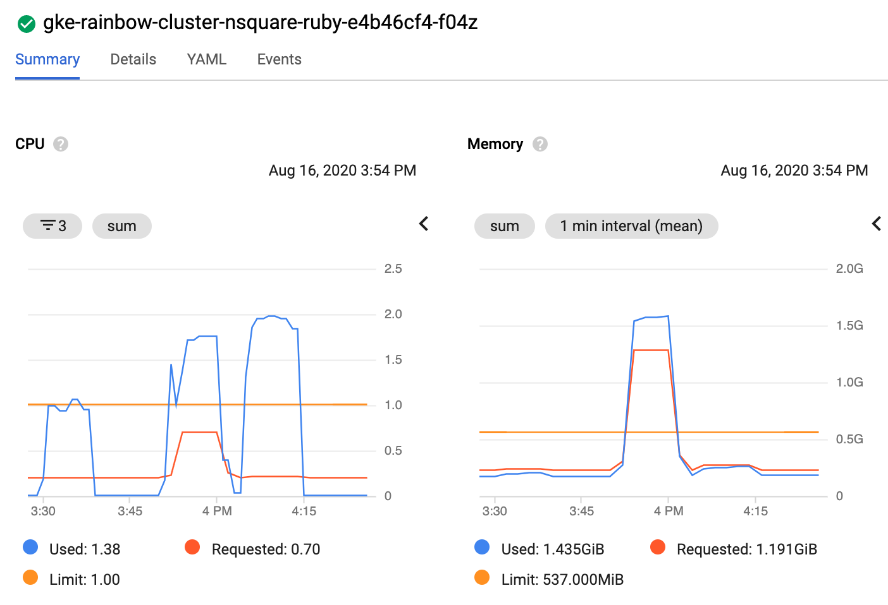
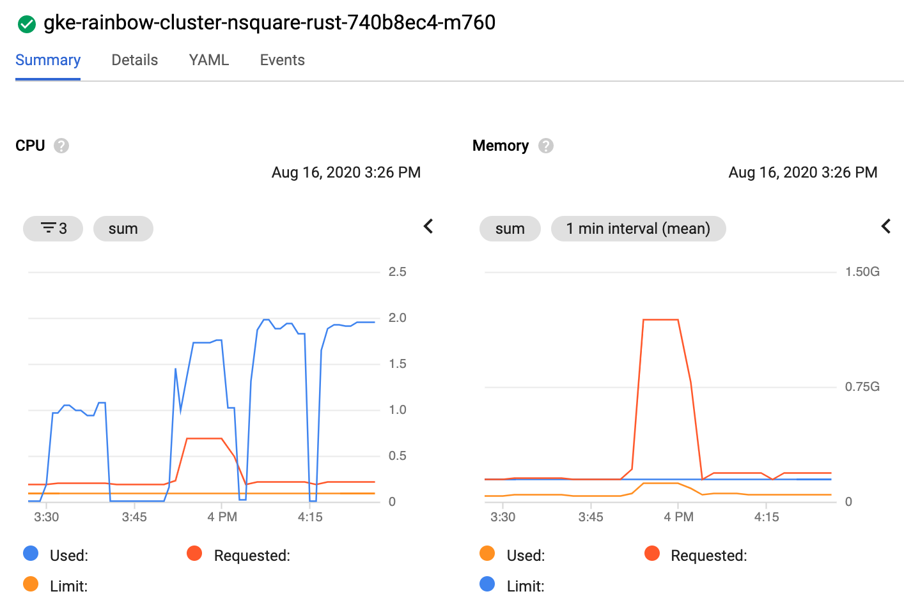

# nsquare

Generate an array of size n and compute a n square operation on it.

## Implementations

* [go](/base/go/nsquare.go)
* [java](/base/java/src/main/java/compute/nsquare.java)
* [python](/base/python/nsquare.py)
* [ruby](/base/ruby/nsquare.rb)
* [rust](/base/rust/src/nsquare.rs)

## Example of implementation

```python
# pyton code

def compute():
    size = int(os.environ['NSQUARE_ARRAY_SIZE'])
    input = [0] * size

    # n square read/write operation
    for i in range(size):
        for j in range(size):
            input[j]=(input[i] + j) / 2
```

## Results

For more information about the testing methodology see [Run the rainbow tests in the cloud](/k8s/README.md).

### Test Output

First use an array size that each language is able to compute.
```
NSQUARE_ARRAY_SIZE=2000
BATCH_SIZE=20
DURATION=10min
MACHINE_TYPE=e2-standard-2 (2xCPU 8GB)
```

| Lang | Replicas | Count |
| --- | --- | --- |
| go | 1 | 165600 |
| go | 4 | 166020 |
| go | 100 | 131940 |
| java | 1 | 149860 |
| java | 4 | 152880 |
| java | 100 | 111120 |
| python | 1 | 1060 |
| python | 4 | 880 |
| python | 100 | 120 |
| ruby | 1 | 1600 |
| ruby | 4 | 1440 |
| ruby | 100 | 160 |
| rust | 1 | 123420 |
| rust | 4 | 104580 |
| rust | 100 | 126580 |

To add more stress, use a larger array.  
Python and Ruby were not able to perform one computation.

```
NSQUARE_ARRAY_SIZE=100000
BATCH_SIZE=1
DURATION=10min
MACHINE_TYPE=e2-standard-2 (2xCPU 8GB)
```

| Lang | Replicas | Count |
| --- | --- | --- |
| go | 4 | 64 |
| java | 4 | 60 |
| rust | 4 | 48 |

Redo first run using a worker pool.

```
NSQUARE_ARRAY_SIZE=2000
BATCH_SIZE=20
DURATION=10min
MACHINE_TYPE=e2-standard-2 (2xCPU 8GB)
```

| Lang | Workers | Replicas | Count |
| --- | --- |  --- | --- |
| go | 10 | 4 | 164640 |
| java | 10 | 4 | 47740 |
| python | 10 | 4 | 480 |
| ruby | 10 | 4 | 800 |
| rust | 10 | 4 | 125840 |

### Node Metrics

* 1st spike: 1 replica, array size 2,000
* 2nd spike: 100 replicas, array size 2,000
* 3rd spike: 4 replicas, array size 2,000
* 4th spike: 4 replicas, array size 10,000 (n.a. for python and ruby)

<br/>
<br/>
<br/>
<br/>
<br/>

## rainbow score

| Lang | Score |
| --- | --- |
| go | 100 |
| java | 93 |
| rust | 76 |
| ruby | 0.96 |
| python | 0.64 |

Maximum value is 100, see [details](/README.md#rainbow-score) for more info.
