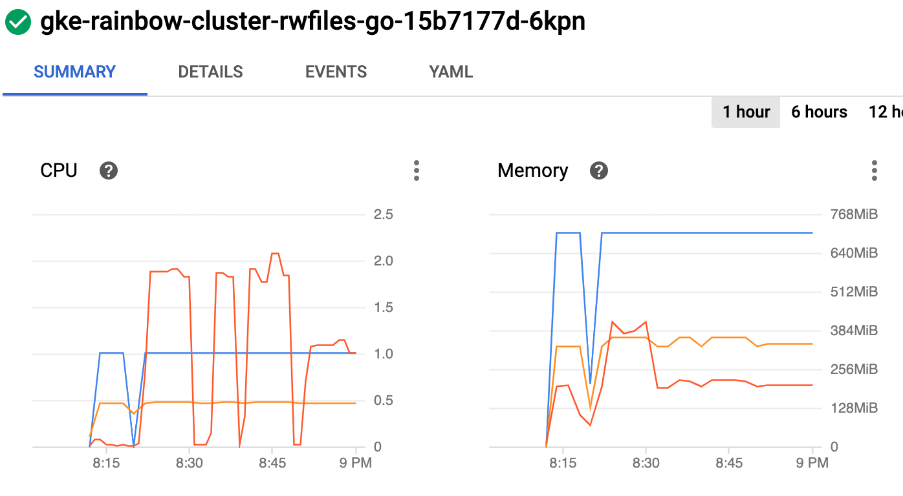
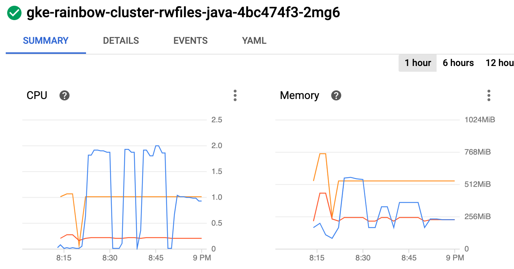
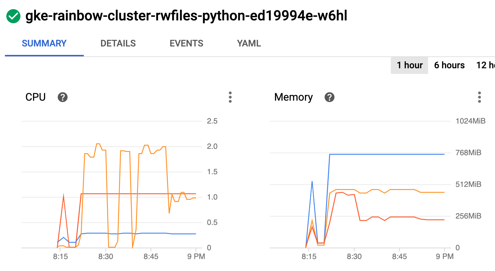
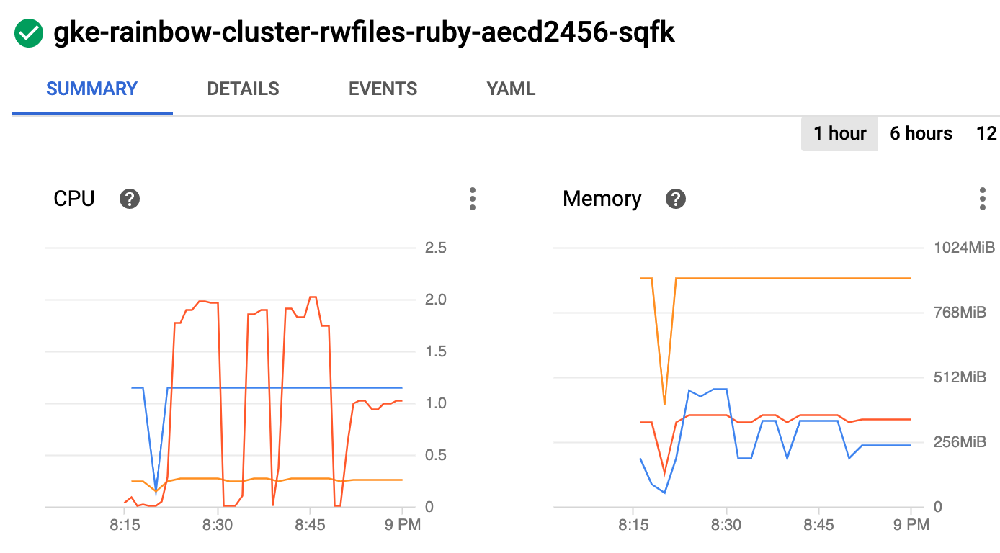
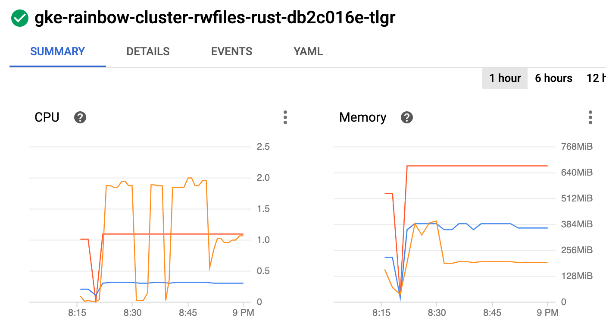

# rwfiles

Write files and access them randomly.

## Implementations

* [go](/base/go/rwfiles.go)
* [java](/base/java/src/main/java/compute/rwfiles.java)
* [python](/base/python/rwfiles.py)
* [ruby](/base/ruby/rwfiles.rb)
* [rust](/base/rust/src/rwfiles.rs)

## Example of implementation

```ruby
# ruby code

writes = ENV['WRITES'].to_i
reads = ENV['READS'].to_i
file_size = ENV['FILE_SIZE'].to_i

# create the file data
data = "0" * file_size

# write the files
files = Array.new(writes)
writes.times { |i|
    path = "/data/#{i}"
    File.write(path, data)
}

# read the files
reads.times {
    index = rand(writes)
    path = "/data/#{index}"
    file = File.open(path)
    file_data = file.read
    file.close
}
```
## Results

For more information about the testing methodology see [Run the rainbow tests in the cloud](/k8s/README.md).

### Test Output


First run: 10k files, 1k each, 20/1 read/write
```
BATCH_SIZE=10
WRITES=10000
READS=200000
FILE_SIZE=1000
DURATION=10min
MACHINE_TYPE=e2-standard-2 (2xCPU 8GB)
```

| Lang | Replicas | Count |
| --- | --- | --- |
| go | 1 | 190 |
| go | 3 | 165 |
| java | 1 | 270 |
| java | 3 | 290 |
| python | 1 | 90 |
| python | 3 | 100 |
| ruby | 1 | 210 |
| ruby | 3 | 210 |
| rust | 1 | 300 |
| rust | 3 | 395 |

Second run: 100 files, 10k each, 2,000/1 read/write
```
BATCH_SIZE=5
WRITES=100
READS=200000
FILE_SIZE=10000
DURATION=10min
MACHINE_TYPE=e2-standard-2 (2xCPU 8GB)
```

| Lang | Replicas | Count |
| --- | --- | --- |
| go | 1 | 175 |
| go | 3 | 165 |
| java | 1 | 240 |
| java | 3 | 290 |
| python | 1 | 100 |
| python | 3 | 100 |
| ruby | 1 | 180 |
| ruby | 3 | 210 |
| rust | 1 | 320 |
| rust | 3 | 395 |

### Node Metrics

* 1st spike: 1 replica, 10k files, 1k each, 20/1 read/write
* 2nd spike: 3 replicas, 10k files, 1k each, 20/1 read/write
* 3rd spike: 3 replicas, 100 files, 10k each, 2,000/1 read/write
* 4th spike: 1 replica, 100 files, 10k each, 2,000/1 read/write

<br/>
<br/>
<br/>
<br/>
<br/>

## Rainbow Scores

| Lang | Score |
| --- | --- |
| rust | 100 |
| java | 73 |
| ruby | 53 |
| go | 46 |
| python | 25 |

Maximum value is 100, see [details](/README.md#rainbow-score) for more info.
