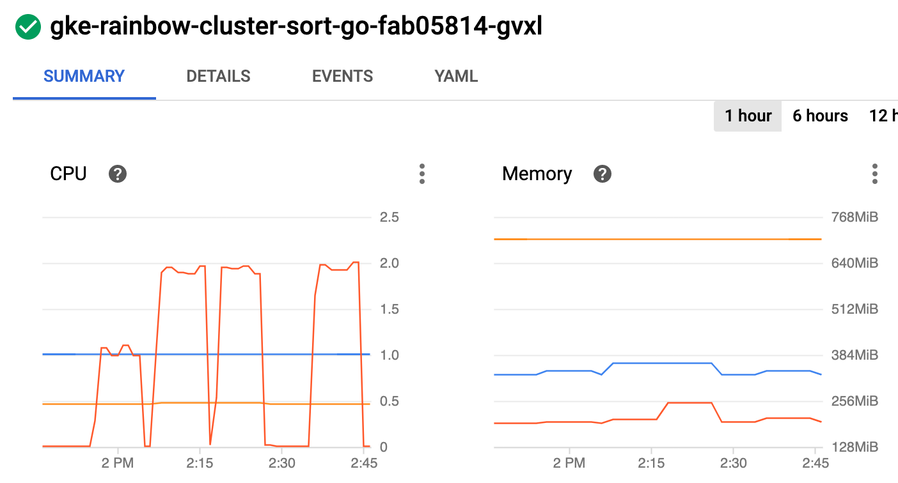
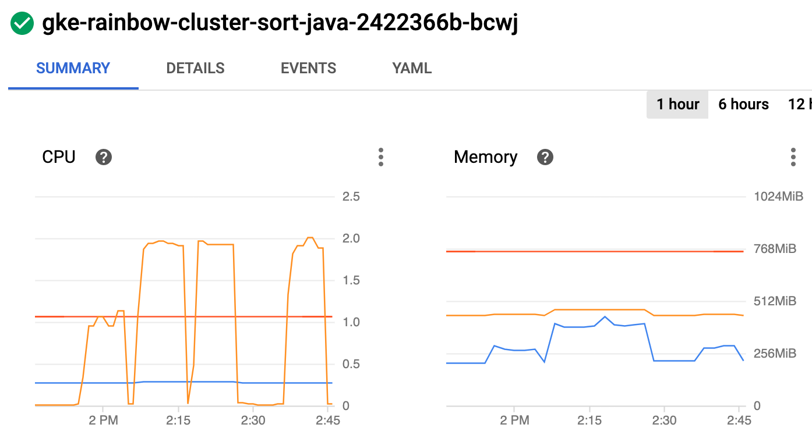
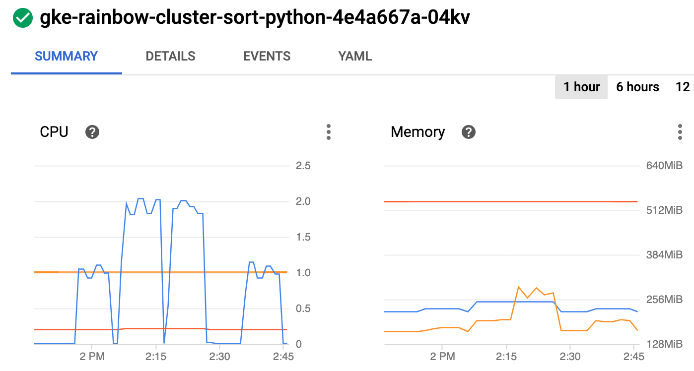
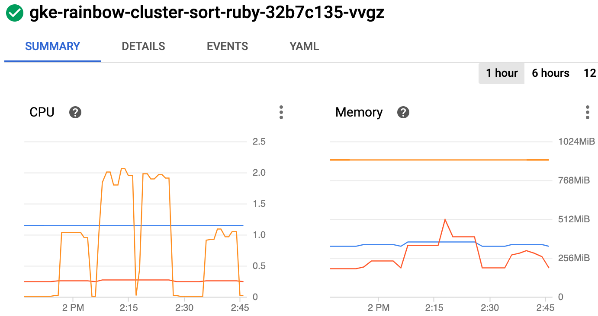
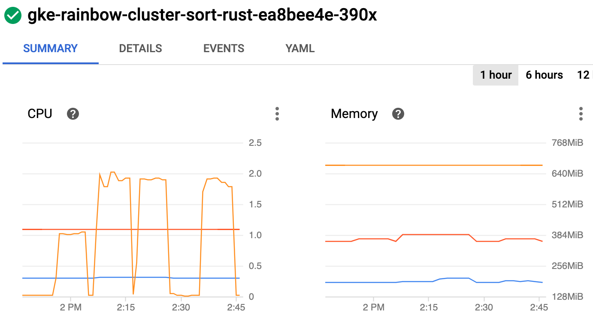

# sort

Generate an array of unsorted integers and sort it using the standard library.

## Implementations

* [go](/base/go/sort.go)
* [java](/base/java/src/main/java/compute/sort.java)
* [python](/base/python/sort.py)
* [ruby](/base/ruby/sort.rb)
* [rust](/base/rust/src/sort.rs)

## Example of implementation

```go
// go code

// size of the array to sort
size, _ := strconv.Atoi(os.Getenv("ARRAY_SIZE"))

//create an input array with unsorted values
input := make([]int, size)
incr := 1
for i := 1; i < size; i++ {
    input[i] = -input[i-1] + incr
    incr = -incr
}

// sort the array
sort.Ints(input)
```

## Results

For more information about the testing methodology see [Run the rainbow tests in the cloud](/k8s/README.md).

### Test Output

First run: array of size 100k

```
BATCH_SIZE=50
ARRAY_SIZE=100000
DURATION=10min
MACHINE_TYPE=e2-standard-2 (2xCPU 8GB)
```

| Lang | Workers | Replicas | Count |
| --- | --- | --- | --- |
| go | 1 | 1 | 40550 |
| go | 1 | 3 | 46650 |
| go | 6 | 1 | 48700 |
| java | 1 | 1 | 151050 |
| java | 1 | 3 | 230850 |
| java | 6 | 1 | 221300 |
| python | 1 | 1 | 23250 |
| python | 1 | 3 | 23850 |
| python | 6 | 1 | 22850 |
| ruby | 1 | 1 | 26800 |
| ruby | 1 | 3 | 27350 |
| ruby | 6 | 1 | 27250 |
| rust | 1 | 1 | 124600 |
| rust | 1 | 3 | 159500 |
| rust | 6 | 1 | 155650 |

Second run: array of size 1M

| Lang | Workers | Replicas | Count |
| --- | --- | --- | --- |
| go | 1 | 3 | 4162 |
| java | 1 | 3 | 19596 |
| python | 1 | 3 | 2357 |
| ruby | 1 | 3 | 2523 |
| rust | 1 | 3 | 13296 |

### Node Metrics

* 1st spike: 1 worker, 1 replica, array of size 100k
* 2nd spike: 1 worker, 3 replicas, array of size 100k
* 3rd spike: 1 worker, 3 replicas, array of size 1M
* 4th spike: 6 workers, 1 replica, array of size 100k

<br/>
<br/>
<br/>
<br/>
<br/>

## rainbow score

| Lang | Score |
| --- | --- |
| java | 100 |
| rust | 68 |
| go | 21 |
| ruby | 12 |
| python | 11 |

Maximum value is 100, see [details](/README.md#rainbow-score) for more info.
